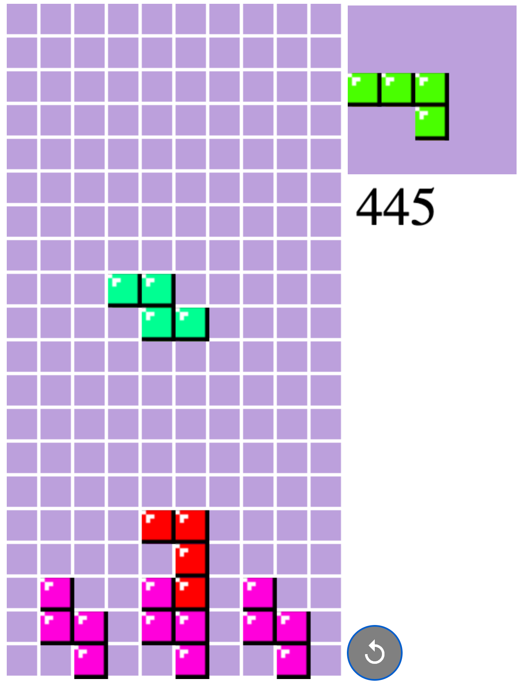
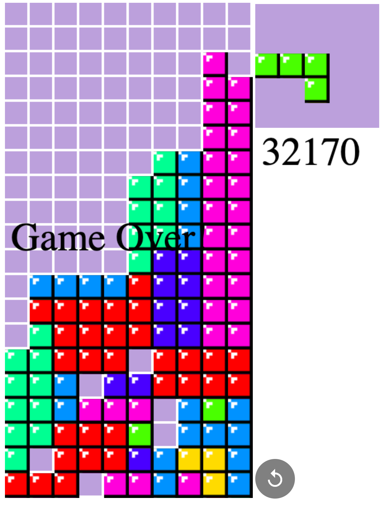

# Tetris Game developed by JavaScript

## Description

Welcome to the world of Tetris! This is a classic arcade game that has been enjoyed by generations of gamers since its introduction in 1984. <br />
I develop own tetris, so everyone can change color, texture and speed of objects(shapes).

---

## Features

- "Repeat" button.
- "Game over" text.
- Scores
- Figures properly changing positions
- Design of BG and figures

---

## Code

### All Statistics

```javascript
const imageSquareSize = 24;
const size = 40;
const framePerSecond = 24;
const gameSpeed = 3;
const canvas = document.getElementById("canvas");
const nextShapeCanvas = document.getElementById("nextShapeCanvas");
const scoreCanvas = document.getElementById("scoreCanvas");
const image = document.getElementById("image");
const ctx = canvas.getContext("2d");
const nctx = nextShapeCanvas.getContext("2d");
const sctx = scoreCanvas.getContext("2d");
const squareCountX = canvas.width / size;
const squareCountY = canvas.height / size;
```
### Shape and color of figures

```javascript
const shapes = [
  new Tetris(0, 120, [
    [0, 1, 0],
    [0, 1, 0],
    [1, 1, 0],
  ]),
  new Tetris(0, 96, [
    [0, 0, 0],
    [1, 1, 1],
    [0, 1, 0],
  ]),
  new Tetris(0, 72, [
    [0, 1, 0],
    [0, 1, 0],
    [0, 1, 1],
  ]),
  new Tetris(0, 48, [
    [0, 0, 0],
    [0, 1, 1],
    [1, 1, 0],
  ]),
  new Tetris(0, 24, [
    [0, 0, 1, 0],
    [0, 0, 1, 0],
    [0, 0, 1, 0],
    [0, 0, 1, 0],
  ]),
  new Tetris(0, 0, [
    [1, 1],
    [1, 1],
  ]),

  new Tetris(0, 48, [
    [0, 0, 0],
    [1, 1, 0],
    [0, 1, 1],
  ]),
];
```

---

## Screenshots

Screenshots from game. <br />

|         |  |
| --------------------------------------- | --------------------------------------- |
|                                 |

---

## Bugs

- When the next figure is the same as the current one, the next one also changes its position.
- Some bugs with textures

---

## Thanks

Thanks for : @ServetGulnaroglu <br />
Hope you enjoy!
